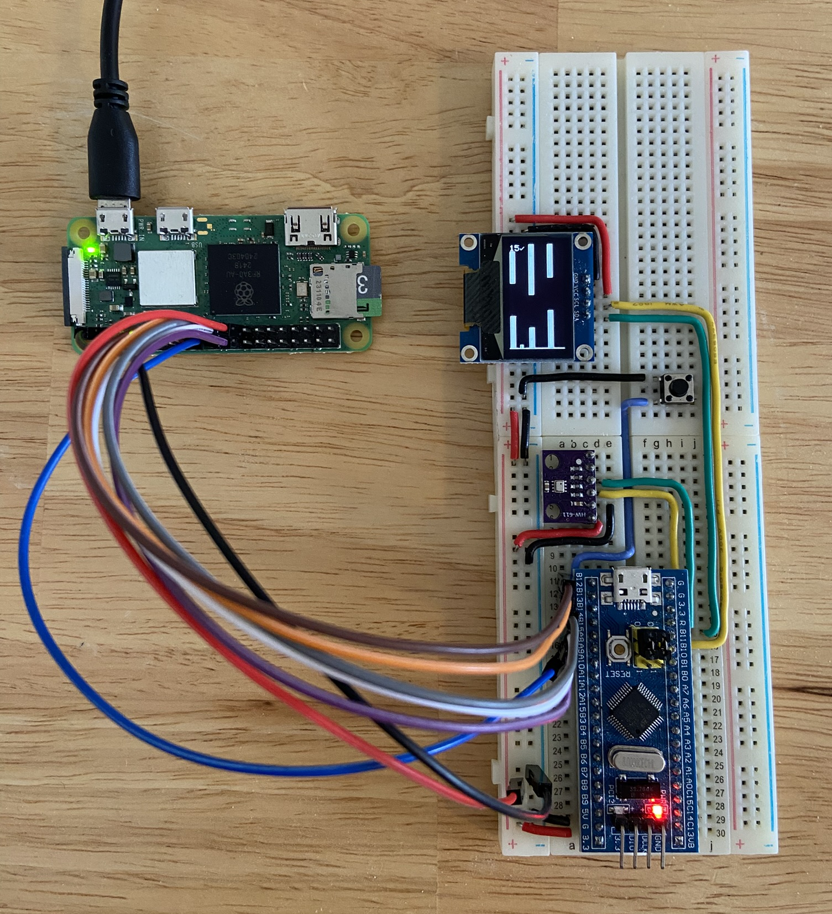

# Flappy Bird for STM32F103

This project is a FreeRTOS-based implementation of the classic Flappy Bird game targeting the STM32F103C8T6 microcontroller (Blue Pill). It uses an SSD1306 128x64 OLED display for graphics and a BMP280 sensor to read the ambient temperature. At the end of each game, the STM32 sends the score and temperature to a Raspberry Pi Zero 2 W, which then uploads the data to [Firebase](https://flappy-bird-scores-default-rtdb.firebaseio.com/.json).

## Hardware usage

- **STM32F103C8T6 microcontroller**: 
   - `PD0` and `PD1`: External HSE clock (72 MHz)
   - `PA13` and `PA14`: Serial Wire Debug
- **SSD1306 128x64 OLED and BMP280 connected on I2C2**: 
   - `PB10`: SCL
   - `PB11`: SDA
- **Raspberry Pi connected on SPI2**: 
   - `PA15`: MOSI
   - `PA14`: MISO 
   - `PA13`: SCK
   - `PA12`: NSS
- **GPIO pins**:
   - `PA8`: SPST button (active low)
   - `PA9`: Data ready output signal to Pi
   - `PA10`: Pi ACK interrupt signal

## Software architecture

The firmware implements four FreeRTOS threads:

- **JumpButtonTask** – handles button presses and debouncing
- **GameTask** – updates the bird, pipes, and score
- **RenderTask** – flushes frame buffer to the OLED and transmits results over SPI when the game ends
- **InitTask** – initializes the OLED and calibrates the BMP280

Game mechanics and rendering are implemented in the `Core` directory:

- `bird.c` / `bird.h`
- `pipe_queue.c` / `pipe_queue.h`
- `oled.c` / `oled.h`
- `bmp280.c` / `bmp280.h`

The score digits and a checkmark glyph are defined in `digits.h`.

## Raspberry Pi Yocto layer

The corresponding image on the Raspberry Pi Zero 2 W is a minimal Linux distribution modified by this [custom Yocto layer](https://github.com/limax2012/meta-custom). The hardware connections on the Raspberry Pi side can be found at that repository.

## Media

